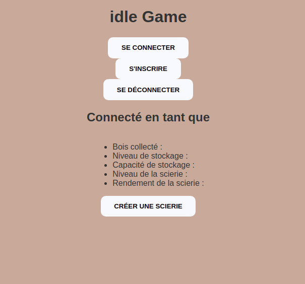
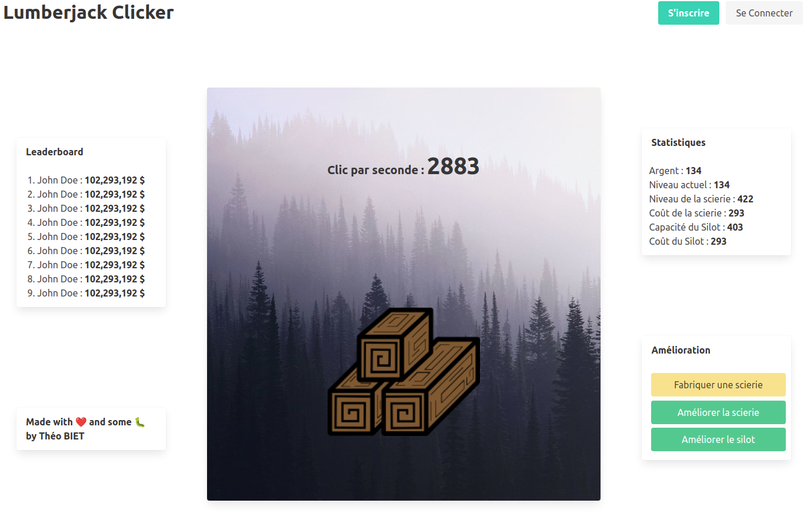

# Lumberjack Clicker 🪓 &nbsp;&nbsp;&nbsp;&nbsp;&nbsp;&nbsp;&nbsp;

## Informations 👀

Take a look

<figcaption style="font-style:italic; font-size:.8em">Start: uh, nothing, i delete all</figcaption>

<figcaption style="font-style:italic; font-size:.8em">2nd version: Front integrated with authentification , API configured and ready to receive new routes</figcaption>

I'm going to sleep, maybe we'll see tomorrow 💤  
... 💤  
... 💤  
... 💤

## Technologies 💻

-   React
-   Express
-   MongoDB

## Local Installation 🏗️

### Prerequisite 🌱

-   [NodeJS](https://nodejs.org/en/)

### Step by step 👣

-   1 | Fork the repository https://github.com/TheoBIET/idle-game
-   2 | ....
-   3 | ....
-   4 | ....
-   5 | ....
-   6 | ....
-   7 | ....
-   8 | Add a star to this repository
-   9 | Enjoy! :)
